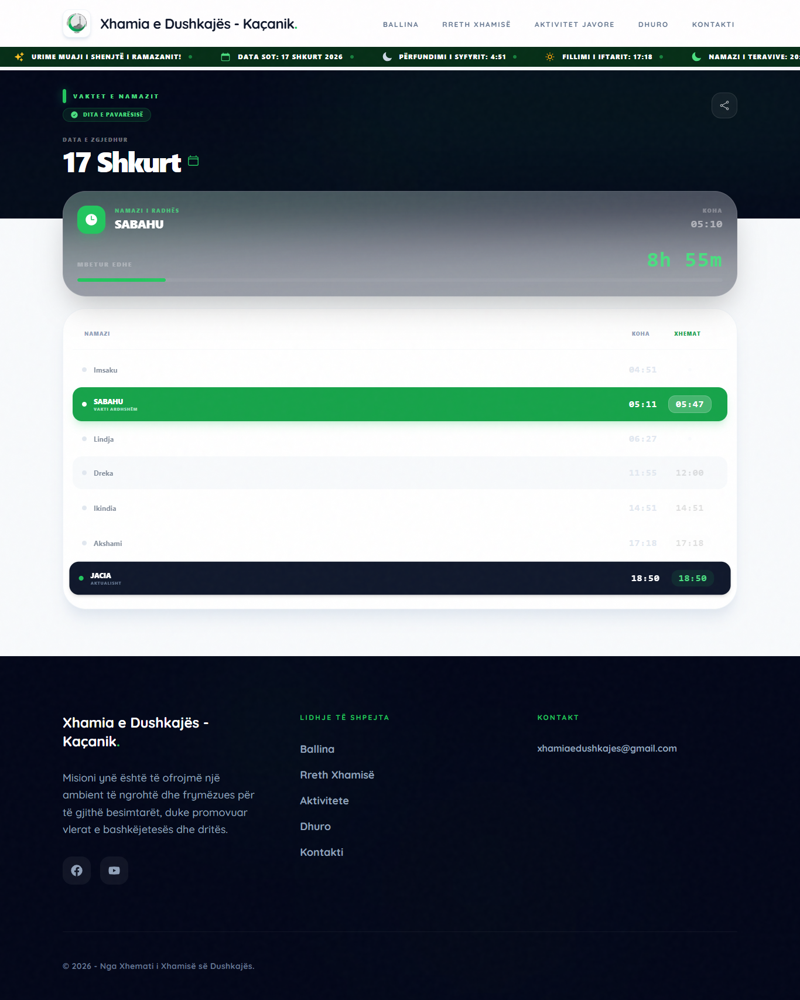
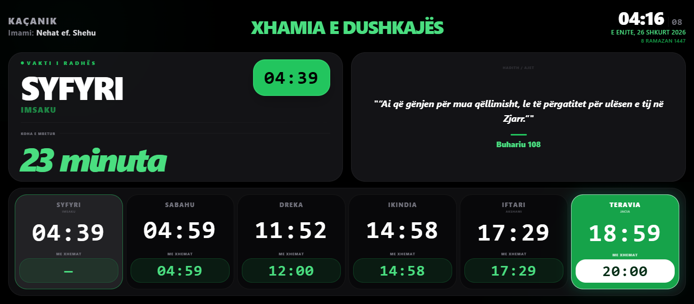

# Xhamia e Dushkajës - Web Portal & TV Module

Një platformë moderne dhe gjithëpërfshirëse për besimtarët, e ndërtuar për të ofruar informacione në kohë reale dhe menaxhuar aktivitetet e xhamisë.

## 🌐 Web Portal (Main Infrastructure)
Platforma është e optimizuar për çdo pajisje (Mobile, Tablet, Desktop), duke ofruar një eksperiencë të pasur vizuale dhe funksionale.

| Ballina | Rreth Xhamisë |
| :---: | :---: |
|  |  |

| Aktivitetet | Kohët e Namazit |
| :---: | :---: |
|  |  |

### Karakteristikat e Web-it:
- **Responsive Design**: Përshtatje e plotë në çdo ekran.
- **Kohët e Namazit**: Llogaritje precize ditore me njoftime vizuale.
- **Kalendari i Aktiviteteve**: Shfaqja e programeve javore dhe ligjëratave.
- **Donacione**: Integrim për kontribute për mirëmbajtjen e xhamisë.

---

## 🖥️ TV Display Module (Digital Signage Add-on)
Si një modul shtesë për xhaminë, aplikacioni përfshin një version të specializuar për ekranet TV, i optimizuar për Digital Signage.

### Karakteristikat e Modulit TV:
- **Dizajn Platinum**: Temë e errët me "Glassmorphism" dhe animacione moderne.
- **Cikli Automatik**: Ndërrim i vazhdueshëm mes Haditheve, QR kodit dhe njoftimeve.
- **Njoftimet Live**: Panel special për të shtuar mesazhe të shpejta (psh: "Ndalohet parkimi", "Ligjërata fillon tani").
- **Optimizimi Teknik**: 3 AM Auto-Reload dhe Screen Wake Lock për qëndrueshmëri 24/7.

---

## 🛠️ Teknologjitë e përdorura
- **React.js**: Logjika e ndërfaqes dhe state management.
- **Tailwind CSS**: Dizajn modern dhe modular i stileve.
- **React Icons**: Librari e ikonave premium (Hi, Io, Lu).
- **Intl API**: Për formatimin e kalendarit hixhri dhe kohës lokale.

## ⚙️ Konfigurimi Qendror (site.json)
E gjithë platforma (Web + TV) kontrollohet nga një pikë e vetme: `src/data/site.json`.
- Të dhënat e xhamisë dhe imami.
- Linku i QR kodit.
- Konfigurimet e Ramazanit.
- Timerat e shfaqjes për modulin TV.

---
Ndërtuar me përkushtim për **Xhaminë e Dushkajës**.
